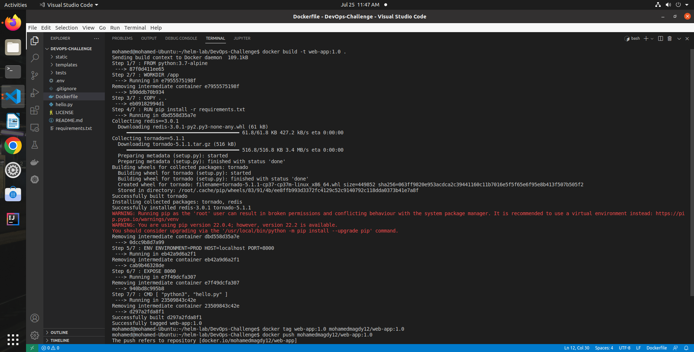
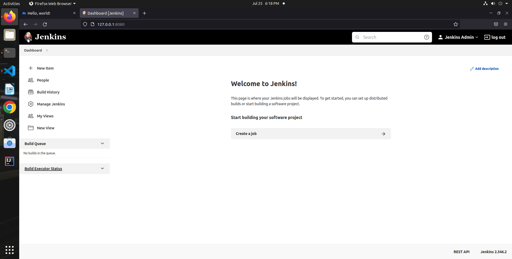

# Helm app

#### Start by containerize the application https://github.com/tradebyte/DevOps-Challenge

```


```

### Create helm chart

```
helm create web-app
```

### run chart on minikube

```
helm install webapp ./web-app
```


### Run the python application


### Cleaning up

```
helm delete webapp
```
## Deploy jenkins 

### Add repo
```
helm repo add jenkins https://charts.jenkins.io
helm repo update
```
### install jenkins

```
helm install jenkins jenkins/jenkins
```

### output




